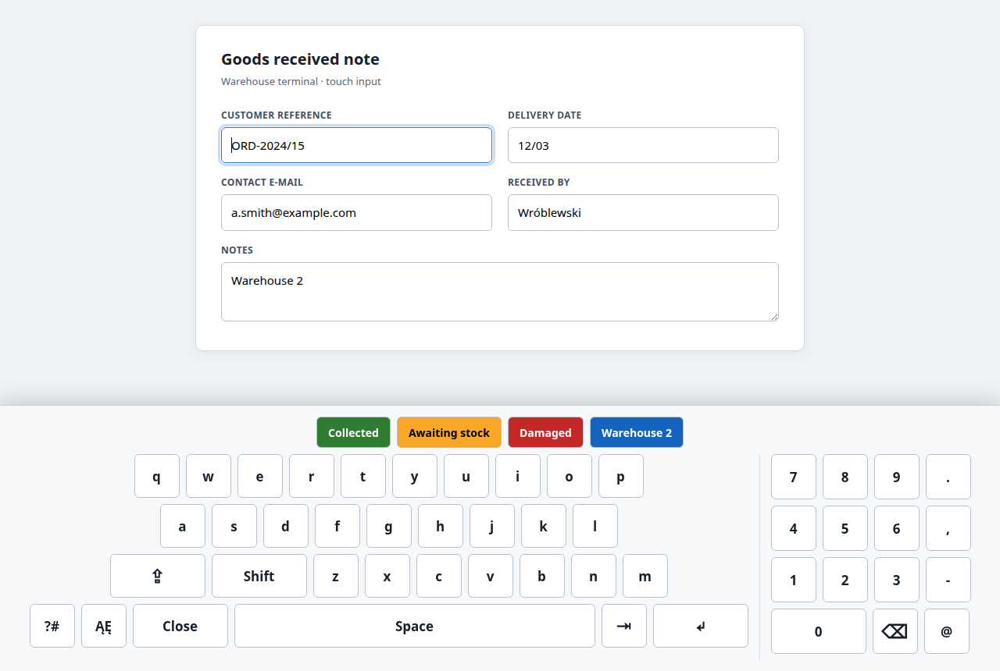
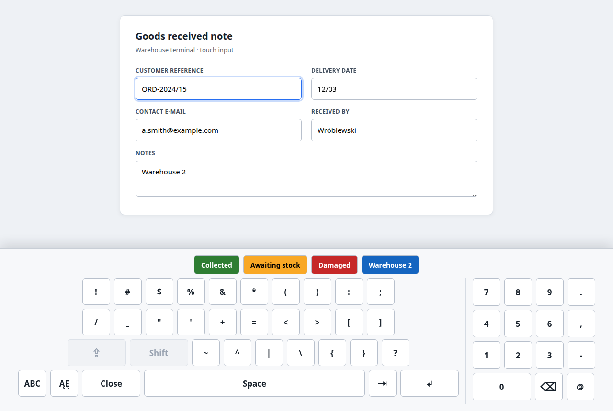
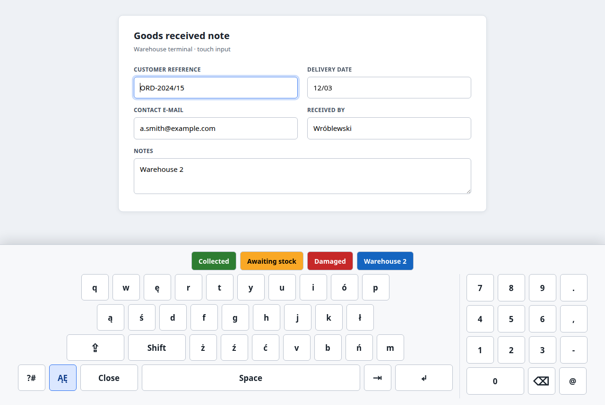

# ScrKeyboard

ScrKeyboard is a Chrome Manifest V3 extension that gives operators of business web applications a comfortable on-screen keyboard on touch screens. It appears when a user focuses an editable field and hides after pressing Enter.

Default language: English. Polish is shipped alongside it as a second UI locale.

Current version: **v0.9.1**.

## Screenshots

The panels below are rendered by ScrKeyboard's own `createKeyboardView` code, unmodified, running over a
sample warehouse form built for this documentation. They show the real keyboard styling, but they are not
captured from the extension running in Chrome against a live customer site, and the form data is fictional.

**Letters mode** — the keypad's punctuation column (`.` `,` `-` `@`) and row four
(`?#`, `ĄĘ`, Close, Space, `⇥`, `↵`), alongside coloured phrase buttons.



**Symbols mode** — `/` and `_` lead row two, and CapsLock and Shift are greyed out
because symbols have no case.



**Diacritics mode** — letters mapped to `ę ó ą ś ł ż ź ć ń`, with the `ĄĘ` key
highlighted while the mode is armed.



## Repository Language

- Conversations and planning with the project owner may happen in Polish.
- Code, comments, documentation, README content, and English UI copy use British English.
- The default product language is English (`en`), with Polish (`pl`) provided as an additional locale.

## Core Features

- Domain controls: whitelist and blacklist, with `*` wildcard and URL-fragment matching.
- Automatic keyboard visibility for editable fields, with Enter-to-submit hiding the panel after input.
- Three keyboard modes: letters (QWERTY with Shift and CapsLock), symbols (three rows of punctuation,
  reached from the `?#` key), and a one-shot Polish diacritics mode (reached from the `ĄĘ` key).
- A numeric keypad with a punctuation column (full stop, comma, hyphen, at sign) available in every mode.
- A Tab key (`⇥`) that moves focus to the next editable field without closing the keyboard panel.
- One-tap keyword and phrase buttons with operator-configurable button colours.
- Setup/options page for domains, language, layout, keyword presets, and CSV export of rules and phrases.
- Chrome Manifest V3 extension structure.

## Settings Model

ScrKeyboard stores configuration in `chrome.storage.sync` under the `scrkeyboard.settings.v1` key.
The whitelist is empty by default, so the keyboard stays inactive until the operator adds an approved site.

URL rules are matched against the full page URL and support `*` wildcards. For operator-friendly setup,
rules without a scheme are treated as URL fragments, so `crm.example.com/orders/*` can match
`https://crm.example.com/orders/123`.

## Popup Workflow

The popup is the operator-friendly entry point:

- enable or disable ScrKeyboard without deleting settings;
- inspect the current site host;
- approve the current site with one button;
- open the full options page.

When the operator approves a site, ScrKeyboard requests runtime access for that origin and stores a whitelist
rule such as `https://crm.example.com/*`.

## Setup Page

The options page is the main setup surface for non-technical operators. It supports:

- global enable/disable control;
- UI language selection for English and Polish, with English as the default;
- Enter or Ctrl+Enter confirmation mode;
- global quick phrases with configurable button colours;
- approved site rules with `*` wildcard support;
- site-specific quick phrases with configurable button colours;
- blocked site rules that take precedence over approved rules;
- Chrome site-access grant controls for explicit HTTP/HTTPS rules;
- CSV export of configured rules and phrases.

Fragment rules such as `crm.example.com/orders/*` can match URLs during evaluation, but Chrome host access
must still be granted from the popup while the target site is open.

## Keyboard Behaviour

On approved pages, ScrKeyboard injects a Shadow DOM keyboard panel docked to the bottom of the viewport.
The panel appears when the operator focuses a supported editable field and hides when the operator presses
Enter, selects Close, or clicks outside an editable field.

The keyboard includes QWERTY letters, symbolic CapsLock, Shift, Space, a large Enter key, Close, configured
phrase buttons, and a right-hand numeric keypad. The numeric keypad uses compact square number keys, a
punctuation column (full stop, comma, hyphen and at sign) present in every mode, and a compact symbolic
Backspace key. CapsLock state is remembered locally with `chrome.storage.local`, so the operator gets the
same CapsLock state after reopening the keyboard or reloading the page.

The main keyboard has three modes:

- **Letters** (default): QWERTY rows with Shift and CapsLock.
- **Symbols**, reached from the `?#` key: full punctuation across three rows, covering marks the letters
  mode and numeric keypad do not, such as `!`, `#`, `$`, `%`, `&`, `*`, `(`, `)`, `:`, `;`, `/`, `_`, `"`,
  `'`, `+`, `=`, `<`, `>`, `[`, `]`, `~`, `^`, `|`, `\`, `{`, `}` and `?`. The key becomes `ABC` while in
  this mode, returning to letters.
- **Polish diacritics**, reached from the `ĄĘ` key: a one-shot mode. It swaps the next letter typed for its
  Polish diacritic form (for example `a` becomes `ą`), then automatically reverts to plain letters. It
  composes with Shift and CapsLock, so `Shift` + `ĄĘ` + `a` gives `Ą`. Because `x` does not occur in Polish,
  its diacritic slot is used for `ź` instead.

A `⇥` key moves focus to the next editable field on the page without closing the keyboard panel, so an
operator can complete a whole form without reaching for a physical keyboard. It only visits fields the
keyboard would actually serve: disabled, read-only and hidden fields are skipped, as are password fields
unless the site's rule explicitly allows them. Tab does not wrap — on the last eligible field, it does
nothing. The newly focused field is scrolled above the keyboard the same way as the initially focused field.

Global and site-specific phrase buttons can use operator-defined button colours from setup. ScrKeyboard
normalises stored colours and automatically uses black or white text, whichever has the stronger contrast
against the selected button colour.

Keyboard keys are sized for comfortable pointer and touch input. Enter dispatches either Enter or Ctrl+Enter
depending on setup. Password fields are ignored unless the matching whitelist rule explicitly allows them.

When the keyboard opens, ScrKeyboard measures the panel and scrolls the active field above it. While the
keyboard is visible, the page gets a temporary bottom inset so footer fields in long forms can still scroll
clear of the fixed keyboard panel.

On windows narrower than 970px, the numeric keypad stacks below the main keyboard instead of sitting beside
it, so every key stays reachable rather than being pushed off the visible panel.

## Manual WebForms Fixture

For a local smoke test, run a static server from the repository root and open the fixture:

```sh
python3 -m http.server 4173 --bind 127.0.0.1
```

Then open `http://127.0.0.1:4173/manual/webforms.html`, approve the site through the ScrKeyboard popup,
and focus the Customer reference field. The keyboard should appear at the bottom of the page. The fixture
shows the last key event so Enter and Ctrl+Enter behaviour can be checked visibly. It also includes a Footer
reference field near the bottom of a long form for checking that the keyboard scrolls focused fields into view.

## Planning

See [docs/PRODUCT_PLAN.md](docs/PRODUCT_PLAN.md).

## Development

The project is a Chrome Manifest V3 extension built with TypeScript, Vite, and vanilla browser APIs.

### Requirements

- Node.js 22 or newer.
- Google Chrome or another Chromium browser for local unpacked-extension testing.

### Install

```sh
npm install
```

### Build

```sh
npm run build
```

The build output is written to `dist/`.

### Load The Extension In Chrome

1. Open `chrome://extensions`.
2. Enable Developer mode.
3. Select Load unpacked.
4. Choose the `dist/` directory from this repository.
5. Confirm that `ScrKeyboard` appears without manifest or service-worker errors.

### Icons

`icons/source.svg` is the single source for the extension icons. The raster
sizes are committed; regenerate them after editing the SVG:

```sh
for size in 16 32 48 128; do
  convert -background none icons/source.svg -resize "${size}x${size}" "icons/icon-${size}.png"
done
```

## Permissions

The MVP uses the smallest permission set needed for the agreed workflow:

- `storage`: stores extension settings in `chrome.storage.sync` and local runtime state, such as the remembered CapsLock setting, in `chrome.storage.local`.
- `activeTab`: lets the popup read the currently active page after the user clicks the extension action.
- `scripting`: injects or registers the keyboard content script only for approved pages.
- `optional_host_permissions`: requests access to user-approved HTTP/HTTPS sites at runtime instead of requesting broad access during installation.

The extension does not use analytics, does not send data to a backend, and does not store text typed by the operator.
